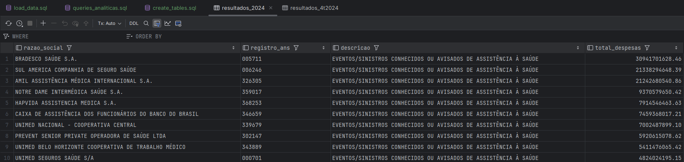
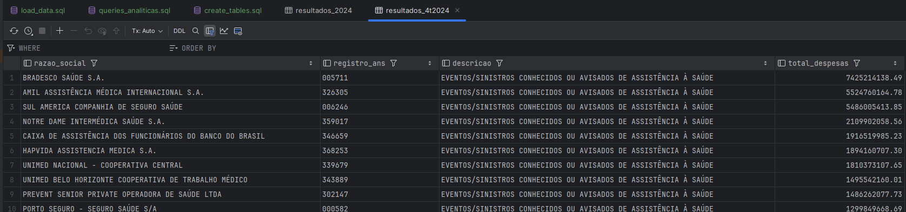

# 📋 DADOS.md - Etapa 3 (Teste de Nivelamento)
## 🚀 Introdução
Neste documento, será detalhado o ambiente necessário para a realização do teste técnico de estágio, compreendendo etapas de obtenção de dados, configuração, importação para banco de dados e análises solicitadas.
## 🛠️ Configuração e Pré-requisitos
### 1. Softwares Necessários
Antes de prosseguir com os scripts SQL, certifique-se de:
- Instalar **MySQL 8** 

- Client SQL sugerido:
    - [MySQL Workbench]
    - No meu caso usei a funcionalidade Database da IDEA **IntelliJ**.

### 2. Configuração MySQL (importante para CSVs)
Por padrão a função de importar arquivos locais é desabilitada por segurança, sendo necessário ativá-la para utilizar o comando `LOAD DATA LOCAL INFILE`.
Execute a query abaixo em load_data.sql para habilitar temporariamente:
``` sql
SET GLOBAL local_infile = 1;
```
Para permanente inserção configure no arquivo `my.ini` ou `my.cnf` do MySQL:
``` 
[mysqld]
local_infile=1

[mysql]
local_infile=1
```
Em seguida, reinicie o servidor MySQL para aplicação definitiva das configurações acima.
## 📥 Obtenção dos Dados
Disponíveis no Portal de Dados Abertos da ANS, realize downloads dos últimos 2 anos dos arquivos:
- Demonstrações contábeis:
    - Link: [Demonstrações Contábeis ANS](https://dadosabertos.ans.gov.br/FTP/PDA/demonstracoes_contabeis/)
    - Baixe todos arquivos CSV referentes aos últimos 2 anos (cada trimestre terá seu CSV).

- Operadoras Ativas na ANS:
    - Link: [Operadoras Ativas](https://dadosabertos.ans.gov.br/FTP/PDA/operadoras_de_plano_de_saude_ativas/)
    - Baixe o CSV atualizado.

Organize seus arquivos no seguinte formato dentro do projeto:
``` 
seu_projeto/
├── Etapa_3
│    ├── dados
│    │   ├── contabeis
│    │   │   ├── 2023
│    │   │   └── 2024
│    │   └── operadoras
│    └── imagens
│        ├── 4t2024.png
│        └── 2024.png
```
## 🪟 Estrutura do Banco de Dados (MySQL)
### ☑️ Tabela operadoras
``` sql
CREATE TABLE operadoras (
    registro_ans VARCHAR(20) PRIMARY KEY,
    cnpj VARCHAR(20),
    razao_social VARCHAR(255),
    nome_fantasia VARCHAR(255),
    modalidade VARCHAR(50),
    logradouro VARCHAR(255),
    numero VARCHAR(50),
    complemento VARCHAR(255),
    bairro VARCHAR(100),
    cidade VARCHAR(100),
    uf CHAR(2),
    cep VARCHAR(15),
    ddd CHAR(3),
    telefone VARCHAR(15),
    fax VARCHAR(15),
    endereco_eletronico VARCHAR(255),
    representante VARCHAR(255),
    cargo_representante VARCHAR(255),
    regiao_comercializacao VARCHAR(100),
    data_registro_ans DATE
);
```
### ☑️ Tabela demonstracoes_contabeis
``` sql
CREATE TABLE demonstracoes_contabeis (
    id INT AUTO_INCREMENT PRIMARY KEY,
    data DATE,
    registro_ans VARCHAR(20),
    cd_conta_contabil VARCHAR(20),
    descricao VARCHAR(255),
    vl_saldo_inicial DECIMAL(20,2),
    vl_saldo_final DECIMAL(20,2),
    FOREIGN KEY (registro_ans) REFERENCES operadoras (registro_ans)
);
```
## 🔗 Importando Arquivos CSV
Use as queries conforme o seguinte exemplo para importar CSVs corretamente:
Operadoras (Exemplo Ajustado):
``` sql
LOAD DATA LOCAL INFILE 'Etapa_3/dados/operadoras/Relatorio_cadop.csv'
INTO TABLE operadoras
FIELDS TERMINATED BY ';'
ENCLOSED BY '"'
LINES TERMINATED BY '\n'
IGNORE 1 ROWS
(registro_ans, cnpj, razao_social, nome_fantasia, modalidade,
logradouro, numero, complemento, bairro, cidade, uf, cep,
ddd, telefone, fax, endereco_eletronico, representante,
cargo_representante, regiao_comercializacao, @data_registro_ans)
SET data_registro_ans = STR_TO_DATE(@data_registro_ans, '%Y-%m-%d');
```
Demonstrações Contábeis (exemplo por trimestre/ano):
``` sql
LOAD DATA LOCAL INFILE 'Etapa_3/dados/contabeis/2024/4T2024.csv'
INTO TABLE demonstracoes_contabeis
FIELDS TERMINATED BY ';'
ENCLOSED BY '"'
LINES TERMINATED BY '\n'
IGNORE 1 ROWS
(@data, registro_ans, cd_conta_contabil, descricao, @vl_saldo_inicial, @vl_saldo_final)
SET
    data = STR_TO_DATE(@data, '%Y-%m-%d'),
    vl_saldo_inicial = REPLACE(REPLACE(@vl_saldo_inicial, '.', ''), ',', '.'),
    vl_saldo_final = REPLACE(REPLACE(@vl_saldo_final, '.', ''), ',', '.');
```
## 📊 Queries Analíticas para Respostas ao Teste
### ▶️ 10 Operadoras com Maiores Despesas no Último Trimestre
``` sql
SELECT o.registro_ans, o.razao_social, 
       SUM(d.vl_saldo_final - d.vl_saldo_inicial) AS despesa_total
FROM demonstracoes_contabeis d
JOIN operadoras o ON d.registro_ans = o.registro_ans
WHERE d.descricao = 'EVENTOS/ SINISTROS CONHECIDOS OU AVISADOS DE ASSISTÊNCIA A SAÚDE MEDICO HOSPITALAR'
  AND QUARTER(d.data) = 4 AND YEAR(d.data) = 2024
GROUP BY o.registro_ans, o.razao_social
ORDER BY despesa_total DESC
LIMIT 10;
```
Arquivo Resultado Exemplificado em: **Etapa_3/imagens/4t2024.png**
### ▶️ 10 Operadoras com Maiores Despesas no Último Ano (2024)
``` sql
SELECT o.registro_ans, o.razao_social, 
       SUM(d.vl_saldo_final - d.vl_saldo_inicial) AS despesa_total
FROM demonstracoes_contabeis d
JOIN operadoras o ON d.registro_ans = o.registro_ans
WHERE d.descricao = 'EVENTOS/ SINISTROS CONHECIDOS OU AVISADOS DE ASSISTÊNCIA A SAÚDE MEDICO HOSPITALAR'
  AND YEAR(d.data) = 2024
GROUP BY o.registro_ans, o.razao_social
ORDER BY despesa_total DESC
LIMIT 10;
```

## ✅ Resultado Final Esperado:


Após execução destas etapas, você terá um banco de dados estruturado e consultas analíticas detalhadas, conforme solicitado no teste. As imagens em `Etapa_3/imagens` fornecem visualização específica das maiores despesas por operadora, úteis para apresentação ou análise futura.

