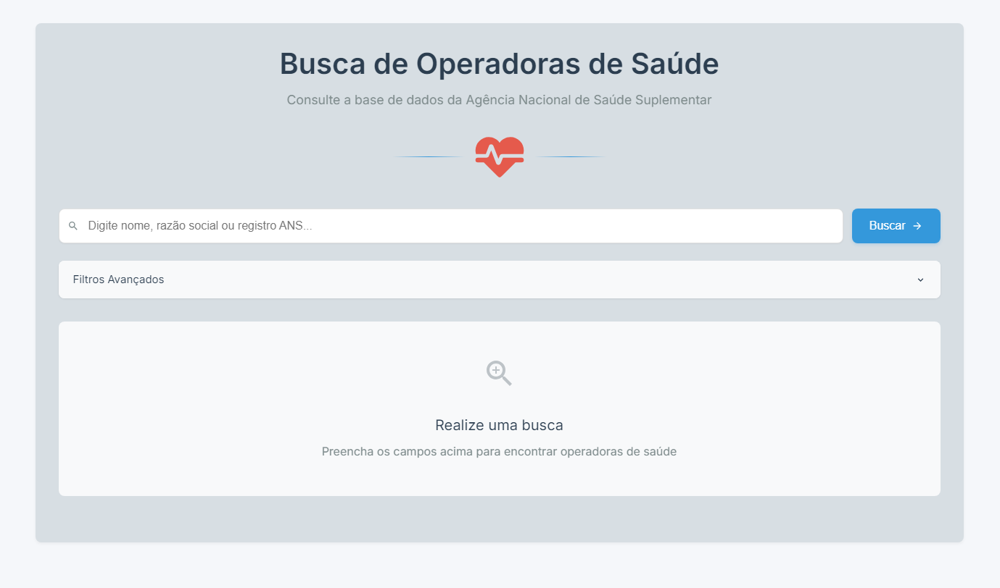
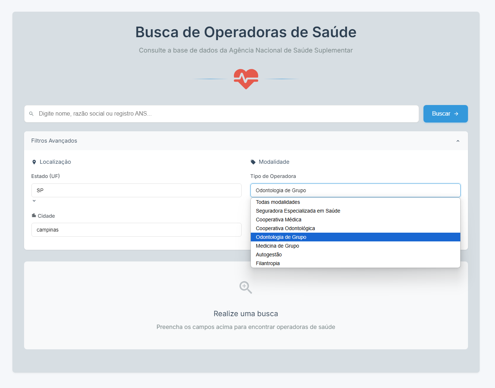
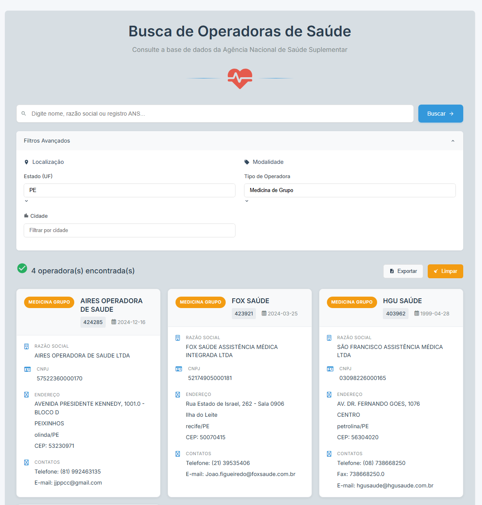

# 📌 README4 - Etapa 4 (Teste Técnico para Estágio)
Esta documentação é referente à Etapa 4 do teste técnico para estágio, que consiste no desenvolvimento de uma aplicação web para realizar buscas em um arquivo CSV contendo cadastros da ANS, usando um servidor backend em **Python (Flask)** e um frontend desenvolvido em **Vue.js (Vite)**.
## 🛠️ Tecnologias Utilizadas
**Backend**
- Python (3.12.x)
- Flask
- Flask-CORS
- Pandas

**Frontend**
- Vue.js 3
- Vite
- Axios
- Iconify

## 📁 Estrutura do Projeto (simplificada):
``` 
Etapa_4/
├── backend/
│   ├── app/
│   │   ├── data/
│   │   │   └── Relatorio_cadop.csv
│   │   ├── main.py
│   │   ├── routes.py
│   │   └── utils.py
│   └── test/
│       ├── postman.http
│       └── postman.json
├── src/
│   ├── App.vue
│   ├── main.js
│   ├── assets/
│   │   └── css/
│   │       ├── main.css
│   │       ├── styles.css    
│   │       └── components/
│   │           ├── SearchHeader.css
│   │           ├── SearchResults.css
│   │           ├── SearchControls.css
│   │           └── ResultCard.css
│   └── components/
│       ├── SearchHeader.vue
│       ├── SearchResults.vue
│       ├── SearchControls.vue
│       └── ResultCard.vue
├── vite.config.js
├── package.json
└── index.html
```
## 🚀 Como executar o Projeto
### ① Backend Flask

#### Dependências necessárias:
- Python versão ≥ 3.8
- pip (gerenciador de pacotes do Python)
- **Instalação Dependências**:
``` bash
cd Etapa_4/backend/app
pip install flask flask-cors pandas
```
- **Executando Servidor Backend**
``` bash
python main.py
```
Servidor Flask disponível em:
``` 
http://localhost:8000
http://192.168.0.14:8000 // Permite acesso em diferentes dispositivos na mesma rede

```
- **Teste básico (rota home):**

Acesse [http://localhost:8000](http://localhost:8000), ou [http://192.168.0.14:8000](http://192.168.0.14:8000) no navegador. A resposta será:
``` html
<h1>Bem-vindo ao servidor Flask!</h1>
```
### ② Frontend Vue (Vite)
- **Instalação das Dependências**:
``` bash
cd Etapa_4
npm install
```
- **Executando o Frontend**
``` bash
npm run dev
```
Frontend disponível por padrão:
``` 
http://localhost:5173
```
## 🔀 Proxy Configuration (Vite):
A API está configurada corretamente no arquivo `vite.config.js`, usando proxy para evitar problemas com CORS.
**`vite.config.js`:**
``` js
server: {
    proxy: {
        '/api': {
            target: 'http://192.168.0.14:8000',
            changeOrigin: true,
            secure: false,
            rewrite: (path) => path.replace(/^\/api/, '')
        }
    }
}
```
> **Observação:** tenha certeza de ajustar o IP/local corretamente para seu ambiente se necessário.
> 

## 🛜 Axios - Configuração e chamadas API
**`main.js`:**
Axios configurado globalmente para realizar as chamadas à API do servidor Flask:
``` js
import axios from 'axios';

axios.defaults.baseURL = 'http://192.168.0.14:8000';
axios.defaults.headers.common['Accept'] = 'application/json';
axios.defaults.headers.common['Content-Type'] = 'application/json';
```
> ⚠️ É fundamental verificar e ajustar o endereço IP local correto durante o desenvolvimento ou testes.

## 🎨 Frontend
O frontend da aplicação oferece uma interface intuitiva, organizada e amigável, criado para simplificar ao máximo a busca por operadoras de saúde cadastradas pela Agência Nacional de Saúde Suplementar (ANS). As funcionalidades principais são destacadas a seguir.
### 🔍 Pesquisa Simples e Avançada




No início, o usuário encontra uma barra de pesquisa simples para buscar operadoras diretamente pelo nome, razão social ou número de registro ANS. Caso deseje fazer uma pesquisa mais específica, há a possibilidade de utilizar filtros avançados como localização (Cidade/UF) e modalidade de operadora.
### 📌 Exibição Clara dos Resultados


Os resultados são apresentados em forma de cards informativos. Cada card mostra detalhes importantes como modalidade da operadora, razão social, número ANS, CNPJ, endereço completo e contatos como telefone e e-mail, esses resultados podem ser exportados em formato csv.
### 🖥️ Feedback Visual em Tempo Real


A interface comunica sua situação atual de maneira visual e fácil de entender:
- **Estado inicial** (nenhuma busca realizada).
- **Carregamento da pesquisa** (feedback visual enquanto aguarda resultados).
- **Resultados vazios** (quando a busca não retorna resultados).
- **Erros e falhas** (com indicação clara e opção de nova tentativa).

> 

## 📌 API REST (Backend Flask)
### Endpoint:
#### Metodo GET:
``` 
/api/operadoras
```
| Parâmetro | Obrigatório? | Exemplo | Finalidade |
| --- | --- | --- | --- |
| `q` | Não | `?q=unimed` | Busca textual (nome/registro ANS) |
| `cidade` | Não | `?q=&cidade=rio%20de%20janeiro` | Cidade da operadora |
| `uf` | Não | `?q=&uf=RJ` | Estado da operadora(UF) |
| `modalidade` | Não | `?q=&modalidade=Seguradora%20Especializada%20em%20Saúde` | Modalidade da operadora |
#### Exemplo de requisição completa:
``` bash
curl "http://localhost:8000/api/operadoras?q=&uf=PE&modalidade=Odontologia%20de%20Grupo"
```
## 📋 Exemplos de Testes com o Postman
Coleção pronta `.json` importável diretamente no Postman ou visualização através do arquivo `.http`.
**Arquivos de testes:**
- JSON: `Etapa_4/backend/test/postman.json`
- HTTP: `Etapa_4/backend/test/postman.http`

### Exemplos disponíveis para testes rápidos da API:
- **Busca Simples por Nome:**
``` http
  GET http://192.168.0.14:8000/api/operadoras?q=Amil
```
- **Busca por UF e Cidade:**
``` http
  GET http://192.168.0.14:8000/api/operadoras?uf=SP&cidade=campinas
```
- **Busca por Modalidade:**
``` http
  GET http://192.168.0.14:8000/api/operadoras?modalidade=Cooperativa%20Médica
```
- **Validação (Erro - Parâmetros faltantes):**
``` http
  GET http://192.168.0.14:8000/api/operadoras
```
## 📡 Exemplos de Retornos JSON (API Server)
**✅ Resultado correto (exemplo):**
``` json
{
  "success": true,
  "count": 1,
  "results": [
    {
      "Registro_ANS": "123456",
      "Razao_Social": "Operadora Saúde ABC",
      "Nome_Fantasia": "ABC Saúde",
      "Cidade": "Campinas",
      "UF": "SP",
      "Modalidade": "Seguros",
      "Telefone": "1123456789",
      "CNPJ": "00000000000100"
    }
  ]
}
```
**❌ Resultado Inválido (sem parâmetros):**
``` json
{
  "success": false,
  "error": "Informe ao menos um critério de busca (nome, cidade, UF ou modalidade)",
  "results": [],
  "count": 0
}
```
## 📎 Notas Adicionais sobre configuração (Ambiente Local):
- **Python SDK:** Configuração do interpretador Python `Teste-IntuitiveCare` na versão Python 3.12.
- **Vite App:** HTML configurado no arquivo `index.html` com FontAwesome e ícone do app.
- **Dependências NPM:** Arquivo `package.json` já definido com as versões necessárias para Vue3, Axios, Iconify e Vite.


